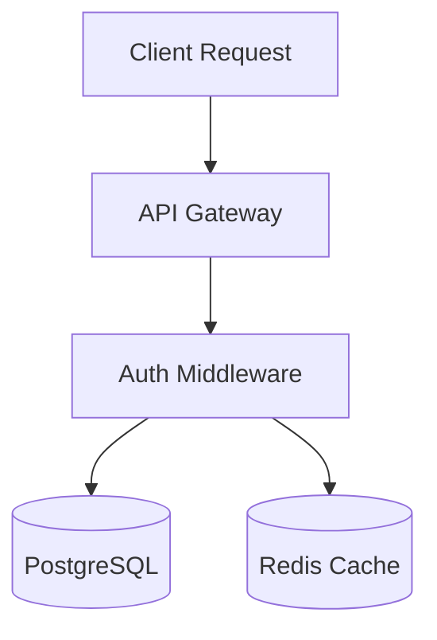
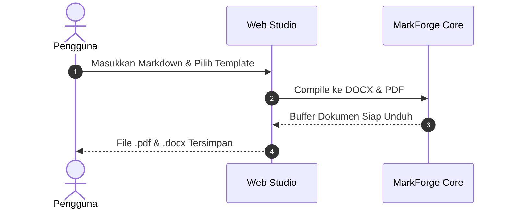

# 📖 Panduan Format & Legenda Sintaks Markdown MarkForge

Panduan komprehensif penulisan dokumen di **MarkForge** agar ter-render sempurna menjadi **PDF profesional**, dokumen **Microsoft Word (DOCX)**, dan tampilan **Web Studio Live Preview**.

---

## 📑 Daftar Isi
1. [Tautan & Hyperlink Interaktif](#1-tautan--hyperlink-interaktif)
2. [Baris Kontak & Header Dokumen](#2-baris-kontak--header-dokumen)
3. [Tipografi & Penekanan Teks](#3-tipografi--penekanan-teks)
4. [Daftar Poin & Indentasi (Nested Bullets)](#4-daftar-poin--indentasi-nested-bullets)
5. [Tabel Terstruktur](#5-tabel-terstruktur)
6. [Kutipan & Kode (Code Block & Inline Code)](#6-kutipan--kode-code-block--inline-code)
7. [Diagram Arsitektur Mermaid](#7-diagram-arsitektur-mermaid)
8. [Tips Menulis Dokumen Lolos Audit ATS & Portfolio](#8-tips-menulis-dokumen-lolos-audit-ats--portfolio)

---

## 1. Tautan & Hyperlink Interaktif

MarkForge mendukung **tautan klik penuh** pada dokumen PDF dan DOCX menggunakan standar Markdown.

### Sintaks Dasar
```markdown
[Teks yang Ditampilkan](URL_Tujuan)
```

### Contoh Praktis:
| Jenis Link | Format Markdown | Tampilan di PDF / DOCX | Target saat Diklik |
| :--- | :--- | :--- | :--- |
| **Profil LinkedIn** | `[LinkedIn](https://linkedin.com/in/rafliiarz)` | <span style="color:#0D9488; text-decoration:underline;">LinkedIn</span> | `https://linkedin.com/in/rafliiarz` |
| **Repositori GitHub** | `[GitHub: rafliiarz](https://github.com/rafliiarz)` | <span style="color:#0D9488; text-decoration:underline;">GitHub: rafliiarz</span> | `https://github.com/rafliiarz` |
| **Live Demo Website** | `[Lihat Demo](https://markforge.dev)` | <span style="color:#0D9488; text-decoration:underline;">Lihat Demo</span> | `https://markforge.dev` |
| **Tautan Email (Mailto)** | `[Email Saya](mailto:rafli@example.com)` | <span style="color:#0D9488; text-decoration:underline;">Email Saya</span> | Membuka email client |
| **Nomor Telepon / WA** | `[+62 812-3456-7890](tel:+6281234567890)` | <span style="color:#0D9488; text-decoration:underline;">+62 812-3456-7890</span> | Membuka dialer / telepon |

> [!TIP]
> **Di PDF**: Menggunakan PDF Annotation `/Subtype/Link` & `/Action/S/URI`. URL panjang tidak akan merusak layout visual dokumen karena disembunyikan rapi di balik teks jangkar (anchor text).
> **Di DOCX**: Dikonversi menjadi OpenXML `ExternalHyperlink` asli Word.

---

## 2. Baris Kontak & Header Dokumen

MarkForge memiliki algoritma pintar untuk mengenali header nama, jabatan, dan baris kontak di bagian awal dokumen.

```markdown
# Rafli Arraafi Albaasith
*Senior Full Stack & Cloud Platform Engineer*
Jakarta, Indonesia • [Email](mailto:rafli@example.com) • [LinkedIn](https://linkedin.com/in/rafliiarz) • [GitHub](https://github.com/rafliiarz) • [Portfolio](https://rafli.dev)
```

- **`# Nama (H1)`**: Pada template CV / Resume, otomatis diposisikan **di tengah (center-aligned)** dengan font 24pt bold.
- **`*Sub-judul (Italic)*`**: Baris teks miring tepat di bawah H1 otomatis dikenali sebagai jabatan/peran profesional.
- **`Contact Bar`**: Baris di 10 baris pertama yang berisi pemisah `•` atau `|` otomatis diformat di tengah dan diberi garis bawah tipis profesional.

---

## 3. Tipografi & Penekanan Teks

| Elemen | Sintaks Markdown | Perilaku Render di MarkForge |
| :--- | :--- | :--- |
| **Section Header (H2)** | `## Work Experience` | Otomatis huruf kapital pada CV, diberi garis bawah pembatas tebal (*divider*), spasi sebelum dan sesudah proporsional. |
| **Sub-Header (H3)** | `### Staff Software Engineer \| ApexCloud` | Judul peran atau nama institusi, dicetak tebal (bold) 10pt. |
| **Sub-Sub-Header (H4)** | `#### 2022 - Sekarang \| Jakarta` | Keterangan tanggal dan lokasi, dicetak 9.5pt. |
| **Teks Tebal (Bold)** | `**Teks Tebal**` | Sangat disarankan untuk menyorot kata kunci teknologi penting. |
| **Teks Miring (Italic)** | `*Teks Miring*` | Untuk istilah serapan, tanggal, atau penekanan halus. |
| **Garis Pembatas (HR)** | `---` | Menghasilkan garis horizontal tipis untuk memisahkan bagian besar. |

---

## 4. Daftar Poin & Indentasi (Nested Bullets)

Format bullet list bertingkat sangat direkomendasikan untuk menjabarkan pencapaian kerja agar mudah dibaca oleh parser ATS.

```markdown
## Work Experience
### Staff Software Engineer | ApexCloud Technologies
*2022 - Sekarang | Jakarta, Indonesia*
- Memimpin perancangan platform event-streaming berbasis Go dan Kafka.
  - Memproses 2.4M pesan/detik dengan SLA ketersediaan 99.999%.
  - Memangkas latensi p99 query database hingga 45% (dari 320ms menjadi 42ms).
  - Menghemat pengeluaran cloud sebesar $180,000 per tahun.
- Mementori 8 engineer junior dalam praktik TDD dan clean architecture.
```

> [!NOTE]
> Gunakan **2 spasi** di awal baris tanda strip `-` untuk membuat sub-poin (level 2). Indentasi akan dipertahankan dengan rapi baik di Word maupun PDF.

---

## 5. Tabel Terstruktur

Tabel Markdown otomatis di-render dengan header berwarna sesuai aksen template yang dipilih:

```markdown
| Kategori | Teknologi & Framework | Tingkat Keahlian |
| --- | --- | --- |
| Bahasa Pemrograman | TypeScript, Go, Python, SQL | Advanced (5+ Tahun) |
| Cloud & DevOps | Docker, Kubernetes, AWS, Cloudflare | Advanced (4 Tahun) |
| Database | PostgreSQL, Redis, ClickHouse | Intermediate |
```

---

## 6. Kutipan & Kode (Code Block & Inline Code)

### Inline Code
Gunakan backtick ganda atau tunggal:
```markdown
Menggunakan `TypeScript`, `Docker`, dan `bun test` untuk pipeline CI/CD.
```
*Tampil sebagai code-pill berwarna abu-abu lembut dengan font monospace.*

### Blockquote
```markdown
> "Arsitektur yang baik adalah arsitektur yang membuat keputusan penting mudah diubah di masa depan."
```

### Code Block
````markdown
```typescript
interface UserConfig {
  theme: 'ats-classic' | 'modern-accent';
  paperSize: 'A4' | 'LETTER';
}
```
````

---

## 7. Diagram Arsitektur Mermaid

MarkForge mendukung kompilasi diagram arsitektur langsung di dalam dokumen.

### A. Flowchart Alur Sistem (`graph TD` atau `graph LR`)
````markdown

````

### B. Sequence Diagram (`sequenceDiagram`)
````markdown

````

- **Di Web Studio**: Ditampilkan sebagai SVG interaktif yang responsive.
- **Di Dokumen DOCX**: Diformat menjadi *callout table* berbingkai khusus dengan label `[Mermaid Flowchart]`.
- **Di Dokumen PDF**: Dikonversi menjadi diagram vektor resolusi tinggi.

---

## 8. Tips Menulis Dokumen Lolos Audit ATS & Portfolio

### 🎯 Formula Resume / CV Lolos ATS (Skor 90–100):
1. **Lengkapi Kontak**: Pastikan ada Email, Nomor HP, Kota, dan LinkedIn di bagian atas dokumen.
2. **4 Section Wajib**:
   - `## Professional Summary`
   - `## Work Experience`
   - `## Education`
   - `## Technical Skills`
3. **Action Verbs**: Awali setiap poin pengalaman dengan kata kerja aksi (*Architected*, *Engineered*, *Optimized*, *Spearheaded*, *Mentored*).
4. **Metrik Kuantitatif**: Selalu sertakan angka terukur (misal: persentase `45%`, nominal uang `$180,000`, volume `2.4M msgs/sec`, jumlah pengguna `60M+ users`).

### 🚀 Formula Developer Portfolio Lolos Audit:
1. Cantumkan section `## Featured Projects`.
2. Sertakan tautan **Live Demo** dan **GitHub Repository** pada setiap nama proyek.
3. Sebutkan daftar tag teknologi (*Stack: Go, React, PostgreSQL*).
4. Jelaskan dampak proyek dengan metrik kinerja nyata.
