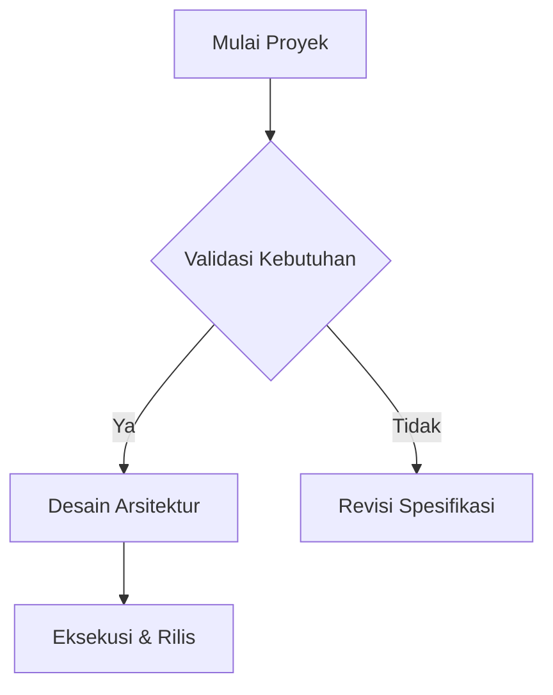

# 🎨 MarkForge Templates & Dynamic Types Guide

MarkForge provides a multi-tier template architecture that separates Markdown content from typographic layout, page margins, and visual styling.

---

## 1. Built-in Preset Templates

MarkForge includes 5 core document presets engineered for specific publication standards:

| Template ID | Name | Primary Font | Accent Color | Intended Use Case |
|---|---|---|---|---|
| `ats-classic` | ATS Classic | Arial / Helvetica | Charcoal `#1e293b` | 100% parseable standard resumes for Taleo, Workday, Greenhouse. Zero layout ambiguity. |
| `modern-accent`| Modern Accent | Inter / Calibri | Emerald `#059669` | Contemporary resumes, software engineer portfolios, and product design CVs. |
| `tech-spec` | Technical Spec | JetBrains Mono / Arial | Indigo `#4f46e5` | RFCs, system architecture blueprints, engineering documentation, and API guides. |
| `academic` | Academic Formal | Times New Roman | Slate `#0f172a` | Theses, journal preprints, research proposals, and literature reviews. |
| `executive` | Executive Suite | Garamond | Bronze `#b45309` | Leadership profiles, board decks, executive biographies, and formal proposals. |

---

## 2. Typographic Parameters & Page Setup

All presets implement standardized A4 dimensions:
- **Dimensions**: $210\text{ mm} \times 297\text{ mm}$ (A4 standard)
- **Standard Margins**: 1 inch ($1440\text{ dxa} \approx 25.4\text{ mm}$) or compact 0.75 inch ($1080\text{ dxa}$).
- **Line Heights**: 1.15 to 1.35 ratio for optimal reading ergonomics.
- **Section Breaks**: Thematic divider borders (`border-b border-zinc-200`) or subtle vertical rule accents.

---

## 3. Dynamic Custom Document Types

In addition to built-in presets, MarkForge supports user-defined document types configured in JSON or created via the Web Studio's **Custom Document Type Modal**.

### 3.1. Document Type Schema
```typescript
export interface DocumentType {
  id: string;                    // Unique slug, e.g. "rfc-template"
  name: string;                  // Display name
  description: string;           // Short explainer
  recommendedTemplates: string[];// Preferred template IDs
  defaultTemplateId: string;     // Default active template
  starterMarkdown: string;       // Default starter template
  auditRubric?: {
    requiredSections?: string[]; // Sections required for audit score
    minWordCount?: number;       // Ideal word count minimum
    actionVerbWeight?: number;   // Weight for action verb heuristics
  };
}
```

### 3.2. Cascading Type Resolution
In the Web Studio, selecting a Document Type cascades recommendations down to the Template Selector:
1. When **CV / Resume** is active $\rightarrow$ `ATS Classic` and `Modern Accent` are highlighted as Recommended.
2. When **Technical Spec** is active $\rightarrow$ `Technical Spec` is highlighted.
3. Switching document types prompts a confirmation dialog offering to replace or retain your current Markdown content.

---

## 4. Mermaid Flowcharts & Diagram Integration

MarkForge natively parses and renders [Mermaid.js](https://mermaid.js.org/) flowcharts and diagrams inside Markdown documents.

### 4.1. Syntax Example
````markdown

````

### 4.2. Supported Diagram Types
- **Flowcharts** (`graph TD`, `graph LR`)
- **Sequence Diagrams** (`sequenceDiagram`)
- **Class Diagrams** (`classDiagram`)
- **State Diagrams** (`stateDiagram-v2`)
- **Entity Relationship Diagrams** (`erDiagram`)
- **Gantt Charts** (`gantt`)

### 4.3. Rendering Pipeline
- **Web Studio Canvas**: Client-side SVG generation via `mermaid.js` with instant dark/light theme coordination.
- **PDF Export**: Headless browser or LibreOffice renders embedded SVG directly into vector curves without pixelation.
- **DOCX Export**: Converted into styled monospace syntax blocks with diagram headers to ensure universal OpenXML reader compatibility.

---

## 5. Production Architecture Mermaid Templates

MarkForge includes a curated catalog of enterprise-grade, battle-tested Mermaid architecture patterns under `@markforge/core`. These templates feature modular subgraphs, protocol edge annotations, and clear data/tier isolation:

| Template ID | Name | Category | Key Architectural Components |
|---|---|---|---|
| `cloud-microservices` | Cloud Microservices & Zero-Trust Ingress | Cloud Infrastructure | Cloudflare Edge CDN/WAF, Envoy API Gateway, JWT verification, core microservices mesh, Kafka event broker, PostgreSQL HA cluster, Redis cache, OpenTelemetry collector. |
| `event-driven-cqrs` | Event-Driven CQRS & Real-Time Ingestion | Event-Driven | Partitioned Kafka buffer, stream workers, append-only event store, Dead Letter Queue (DLQ), read model projector, and Elasticsearch search index. |
| `hexagonal-architecture` | Clean Hexagonal Architecture (Ports & Adapters) | Software Design | Domain-Driven Design (DDD) with Driving Adapters (REST/CLI/GraphQL), Application Core Use Cases, Domain Entities & Aggregates, and Driven Ports (Repository, Storage, Email). |
| `zero-trust-security` | Zero-Trust Security & Identity Mesh | Security | Identity Provider (OIDC/SAML), Policy Enforcement Point (PEP), Open Policy Agent (OPA) engine, SPIFFE/SPIRE workload mTLS mesh, and immutable SIEM audit logs. |
| `multi-region-resilience` | Multi-Region High-Availability & Disaster Recovery | Resilience | Anycast Geo-DNS, active Kubernetes cluster in primary region, warm standby secondary region, and cross-region asynchronous database WAL replication. |
| `standard-flowchart` | Production Lifecycle & Decision Logic | Workflow | Standard production engineering lifecycle with AST validation checkpoints, error recovery branches, and format rendering. |

### 5.1. Using Templates in Web Studio
1. In the Web Studio editor toolbar, click the **Diagram Mermaid** button or the adjacent dropdown chevron.
2. Select any production architecture pattern from the menu to insert the complete, pre-styled diagram into your Markdown document at the cursor position.
3. Alternatively, open the **Panduan Sintaks (Syntax Guide)** modal (`MarkdownCheatsheetModal`), switch to the **Mermaid** tab, and click **"Sisipkan ke Editor"** or **"Salin"**.

### 5.2. Programmatic API (`@markforge/core`)
```typescript
import { listMermaidTemplates, getMermaidTemplate } from '@markforge/core';

// List all 6 production architecture templates
const templates = listMermaidTemplates();

// Get specific template by ID
const cloudTemplate = getMermaidTemplate('cloud-microservices');
console.log(cloudTemplate.diagram);
```

